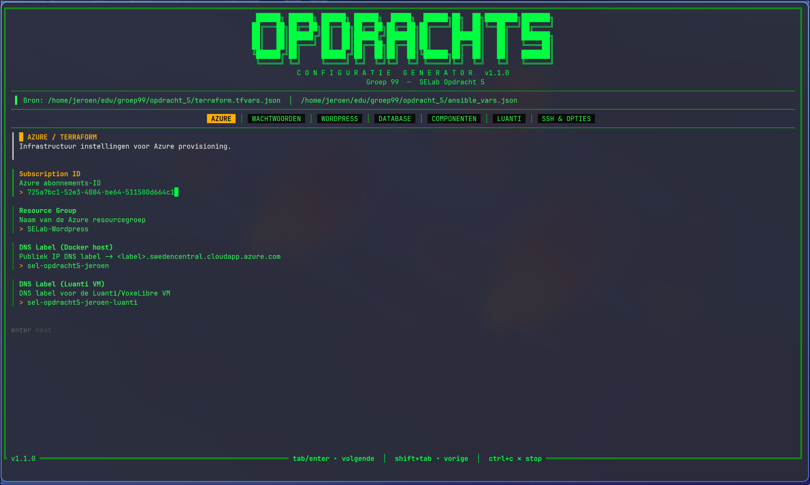

# Opdracht 4 - WordPress op Azure

Volledig geautomatiseerde deployment van een WordPress stack op Azure met **Terraform** voor provisioning en **Ansible** voor configuratiebeheer.  We gebruiken **Makefile** om deze uit te voeren.

## Inhoudsopgave

- [Opdracht 4 - WordPress op Azure](#opdracht-4--wordpress-op-azure)
  - [Inhoudsopgave](#inhoudsopgave)
  - [Wat wordt er aangemaakt](#wat-wordt-er-aangemaakt)
  - [Vereisten](#vereisten)
  - [Snel aan de slag](#snel-aan-de-slag)
  - [Make targets](#make-targets)
    - [Variabelen en secrets](#variabelen-en-secrets)
    - [SSH sleutel aanpassen](#ssh-sleutel-aanpassen)
  - [Hoe werkt het](#hoe-werkt-het)
  - [Projectstructuur](#projectstructuur)
  - [Optionele componenten](#optionele-componenten)
  - [Beveiliging](#beveiliging)
  - [Na deployment](#na-deployment)
  - [Opruimen](#opruimen)
  - [Mogelijke uitbreidingen](#mogelijke-uitbreidingen)

## Wat wordt er aangemaakt

| Laag | Tool | Resources |
|---|---|---|
| **Infrastructuur** | Terraform | Resource Group, VNet, Subnet, NSG, Publiek IP, NIC, Ubuntu 22.04 VM, MySQL Flexible Server, firewallregels, auto-shutdown schema |
| **Configuratie** | Ansible | SSH hardening, UFW, fail2ban, Apache + PHP, WordPress, WP-CLI, remote MySQL database & gebruiker via SSL |

## Vereisten

| Vereiste | Opmerkingen |
|---|---|
| [Terraform](https://developer.hashicorp.com/terraform/install) ≥ 1.5 | Infrastructuur provisioning |
| [Azure CLI](https://learn.microsoft.com/cli/azure/install-azure-cli) | Authenticatie (`az login`) |
| [uv](https://astral.sh/uv) | Python dependency beheer (Ansible in geïsoleerde venv) |
| [Python](https://www.python.org/) ≥ 3.12 | Runtime voor Ansible |
| SSH sleutelpaar | Standaard: `~/.ssh/id_ed25519_hogent` |
| [Make](https://makefiletutorial.com/) | Makefile command runner |

> **📖 Gedetailleerde installatie-instructies** per OS (Windows/WSL, macOS, Debian, Arch, Gentoo, NixOS, FreeBSD): zie **[PREREQUISITES.md](PREREQUISITES.md)**

Op **NixOS** kan je de dev shell opstarten met `nix develop`.

## Snel aan de slag

```bash
# 1. Log in bij Azure, opent browser voor login
az login

# 2. Maak je configuratiebestanden aan
cp terraform.tfvars.json.example terraform.tfvars.json
cp ansible_vars.json.example ansible_vars.json

# 3. Vul minstens subscription_id, public_ip_dns_label en mysql_admin_password in
#    Of gebruik de TUI config generator:
cd config-starter && make run

# 4. Deploy alles
make init
make all
```


Dat is alles. WordPress draait op het publieke IP van de VM.

## Make targets

Voer `make` of `make help` uit om alle targets te zien:

| Target | Beschrijving |
|---|---|
| `make init` | Terraform initialiseren (providers downloaden) |
| `make plan` | Bekijk wat Terraform zou aanmaken/wijzigen |
| `make apply` | Alle Azure infrastructuur aanmaken |
| `make configure` | Ansible playbook uitvoeren (leest automatisch Terraform outputs) |
| `make all` | **`apply` + `configure`** in één keer |
| `make info` | Huidige Terraform outputs tonen (IPs, FQDNs, …) |
| `make destroy` | Alle Azure resources verwijderen |
| `destroy-vm` | Enkel de VM en dependencies verwijderen (netwerk, compute) |
| `make clean` | Lokale Terraform state & cache opruimen |

### Variabelen en secrets

De configuratie is opgesplitst in twee bestanden in de projectroot:

| Bestand | Inhoud |
|---|---|
| `terraform.tfvars.json` | Azure subscription, DNS label, MySQL admin wachtwoord |
| `ansible_vars.json` | WordPress instellingen, wachtwoorden, SSH config |

Voorbeeldbestanden: `terraform.tfvars.json.example` en `ansible_vars.json.example` (staan in `.gitignore`).

Het MySQL admin wachtwoord staat in `terraform.tfvars.json` en wordt automatisch doorgegeven aan zowel Terraform als Ansible. De SSH publieke sleutel wordt automatisch gelezen van `~/.ssh/id_ed25519_hogent.pub`.

> **Tip:** Gebruik de interactieve TUI config generator om beide bestanden aan te maken:
> ```bash
> cd config-starter && make run
> ```

Compileer zelf (golang - fast&easy cross compilation) of haal de laatste binary [hier (github)](https://github.com/mtdig/az-wp-inst/releases/latest).



### SSH sleutel aanpassen

```bash
make apply SSH_KEY=~/.ssh/mijn_andere_sleutel
```

## Hoe werkt het

```
make all
  │
  ├─ make apply          ← Terraform maakt Azure resources aan
  │   └─ outputs: public_ip_address, mysql_fqdn, admin_username, …
  │
  └─ make configure      ← Ansible configureert de VM
      ├─ leest automatisch Terraform outputs
      ├─ verbindt via SSH naar het publieke IP van de VM
      └─ geeft MySQL FQDN + admin login door als extra vars
```

Terraform outputs worden bij configure-time gelezen en via `-e` extra vars en dynamische inventory in de Ansible run geïnjecteerd. Geen handmatig kopiëren van IPs of hostnamen nodig.

## Projectstructuur

```
opdracht4/
├── Makefile                     # Orkestreeert alles
├── terraform.tfvars.json        # Azure & MySQL configuratie
├── ansible_vars.json            # Ansible/WordPress configuratie
├── .gitignore
├── flake.nix                    # NixOS dev shell
├── pyproject.toml / uv.lock    # Python/Ansible dependencies
│
├── config-starter/              # TUI configuratie generator (Go)
│   ├── main.go
│   ├── Makefile
│   └── version.txt
│
├── provisioning/                # Terraform root
│   ├── main.tf
│   ├── variables.tf
│   ├── outputs.tf
│   ├── terraform.tfvars
│   ├── README.md
│   └── modules/
│       ├── network/             # VNet, Subnet, NSG, Publiek IP, NIC
│       ├── compute/             # Ubuntu VM + auto-shutdown
│       └── database/            # MySQL Flexible Server + firewallregels
│
├── configuration_management/    # Ansible root
│   ├── ansible.cfg
│   ├── inventory.yml
│   ├── vault.yml                # encrypted secrets (voor deze opdracht niet encrypted)
│   ├── README.md
│   ├── playbooks/
│   │   └── site.yml
│   └── roles/
│       ├── common/              # SSH, UFW, fail2ban
│       ├── mysql_client/        # MySQL client, remote DB/gebruiker aanmaak
│       ├── wordpress/           # Apache, PHP, WordPress, WP-CLI
│       ├── vaultwarden/          # Vaultwarden wachtwoordkluis (Docker, /secrets)
│       └── tech_snake/          # snake game (/snake)
│
└── devops/                      # Originele ARM templates (ter referentie)
    ├── mysql/
    └── ubuntu/
```

## Optionele componenten

Deze componenten zijn standaard uitgeschakeld en kunnen via `ansible_vars.json` (of de TUI config generator) ingeschakeld worden:

| component | flag | rpute | beschrijving |
|---|---|---|---|
| **Vaultwarden** | `enable_vaultwarden` | `/secrets` | Self-hosted wachtwoordkluis (draait als Docker container). Lichtgewicht Bitwarden-compatibele server. |
| **Tech Snake** | `enable_tech_snake` | `/snake` | Godot WebAssembly snake game. |

Voorbeeld in `ansible_vars.json`:

```json
{
  "enable_vaultwarden": true,
  "enable_tech_snake": true
}
```

## Beveiliging

De volgende maatregelen worden automatisch toegepast:

| Maatregel | Beschrijving |
|---|---|
| **Wordfence** | Firewall + malware scanner (gratis licentie accepteren via WP dashboard) |
| **Limit Login Attempts Reloaded** | Brute-force bescherming op wp-login.php |
| **Disable XML-RPC Pingback** | Blokkeert XML-RPC misbruik (DDoS amplificatie, credential brute-force) |
| **fail2ban - wordpress-login** | Bant IP's op serverniveau na 5 mislukte inlogpogingen in 5 min |
| **fail2ban - sshd** | Bant IP's na 3 mislukte SSH pogingen |
| **Apache hardening** | Verbergt serverversie, blokkeert `xmlrpc.php`, beveiligingsheaders (X-Frame-Options, CSP, etc.) |
| **wp-config hardening** | Bestandseditor uitgeschakeld, HTTPS admin afgedwongen, auto security-updates |
| **UFW firewall** | Alleen poort 22, 80, 443 open |
| **SSH hardening** | Wachtwoord-login uitgeschakeld, alleen pubkey authenticatie |
| **Let's Encrypt SSL** | HTTPS met automatische redirect |

## Na deployment

`make configure` werkt automatisch je lokale `~/.ssh/config` bij met een `azosboxes` alias (er wordt eerst een backup gemaakt naar `~/.ssh/config.bak`). Daarna kan je eenvoudig verbinden:

```bash
# Outputs bekijken
make info

# SSH naar de VM (via automatisch aangemaakte alias)
ssh azosboxes

# Of handmatig
ssh osboxes@$(cd provisioning && terraform output -raw public_ip_address)

# WordPress openen
# Open: https://<dns-label>.swedencentral.cloudapp.azure.com
```

## Opruimen

```bash
make destroy
```

## Mogelijke uitbreidingen

- [ ] **Multi-environment support** — Meerdere deployments (dev/prod/per-lid) vanuit dezelfde codebase:
  - `envs/` map met aparte var-files per omgeving (`test2.tfvars.json`, `dev.tfvars.json`, `prod.tfvars.json`, …)
  - Terraform workspaces of remote backend met dynamische state key
  - `make all ENV=dev` / `make all ENV=prod`
  - Environment-selector in de TUI config generator

